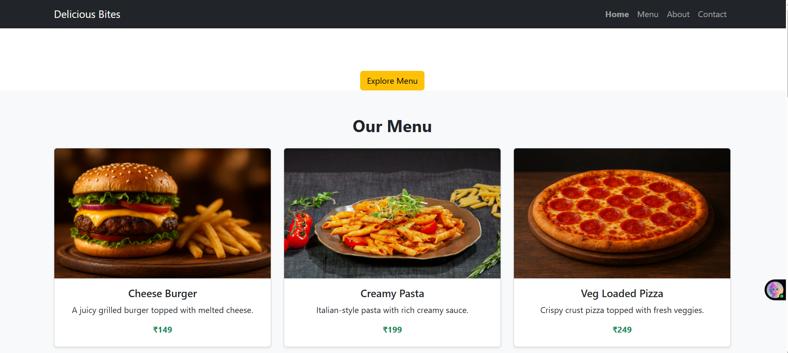
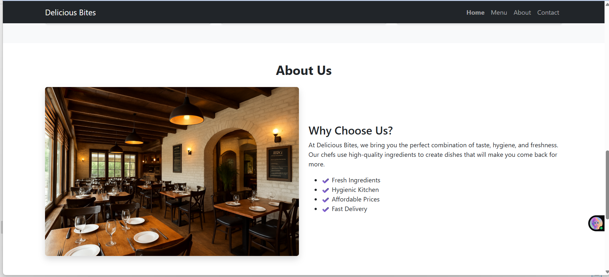
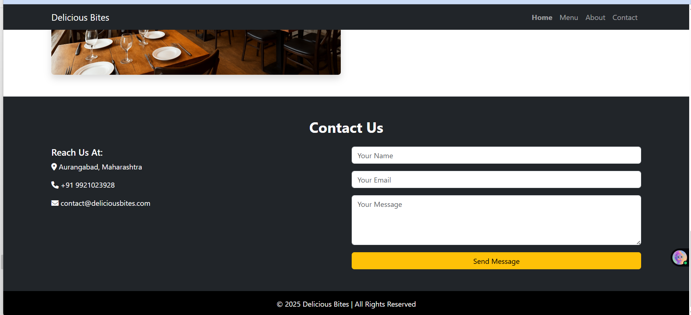

# 🍽️ Delicious Bites – Modern Responsive Restaurant Website

Delicious Bites is a modern and fully responsive restaurant website designed to provide an engaging and user-friendly experience.
The project focuses on clean UI, responsive layout, and attractive presentation suitable for real-world restaurant businesses.

## 🚀 Live Demo
https://archanaingle03.github.io/delicious-bites-restaurant-website/

## 🛠️ Technologies Used
- HTML5  
- CSS3  
- Bootstrap 5  

## ✨ Features
- Fully responsive design (mobile, tablet, desktop)
- Modern and clean user interface
- Responsive navigation bar
- Restaurant sections such as home, menu, and contact
- Image gallery for food display
- Simple and well-structured code

## 📁 Project Structure
📦 delicious-bites-restaurant-website
┣ 📂 img
┣ 📄 index.html
┣ 📄 style.css

---

## 📸 Screenshots

### Home Page

### Menu Section

### Contact Section

## 👩‍💻 Author
**Archana Ingle**  
- GitHub: https://github.com/archanaingle03  

## 📌 Purpose
This project was created for learning and practice purposes to improve front-end web development skills using HTML, CSS, and Bootstrap.

⭐ If you like this project, feel free to give it a star!
